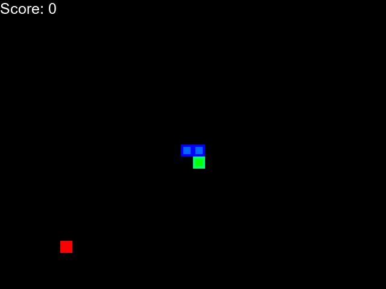
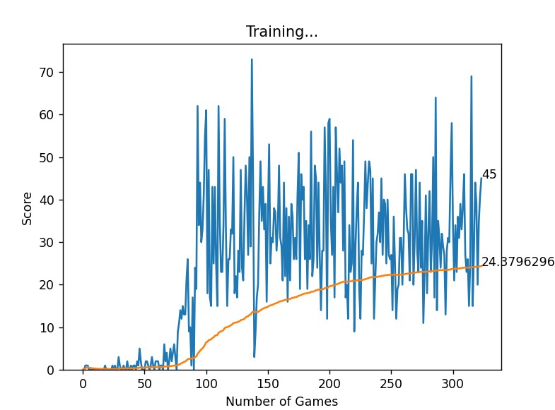

# snake-RL
This project trains a Deep Q-Network (DQN) algorithm to play a snake game. The repository contains the game environment, DQN implementation, and utilities for training and visualizing results.

Below is the best run of the algorithm:



## Usage

To train the DQN model:

```bash
python agent.py --train --episodes <total no. of episodes>
```

To play the game with trained model:

```bash
python agent.py --play --episodes <total no. of episodes> -- record
```


## Description

- **`env.py`**: Contains the snake game environment.
- **`agent.py`**: Contains the DQN training logic, reward calculation, and state representation.
- **`model.py`**: Contains the implementation of the DQN model.
- **`utils.py`**: Contains the plotting code for visualizing training progress.

## Dependencies

To run this project, you need the following Python packages:

- `torch`
- `pygame`
- `numpy`
- `matplotlib`
- `os`
- `imageio`

You can install the required packages using pip:

```bash
pip install torch pygame numpy matplotlib imageio
```

## Score vs. Episode Plot

Below is the plot of the score achieved by the DQN agent over different Episodes:

{:width="320px" height="240px"}

## Known Issues

- Cannot move or interact with training plots and game window during training.
- Training plot is not saved after training.
- Low fps and no looping in the best run gif.